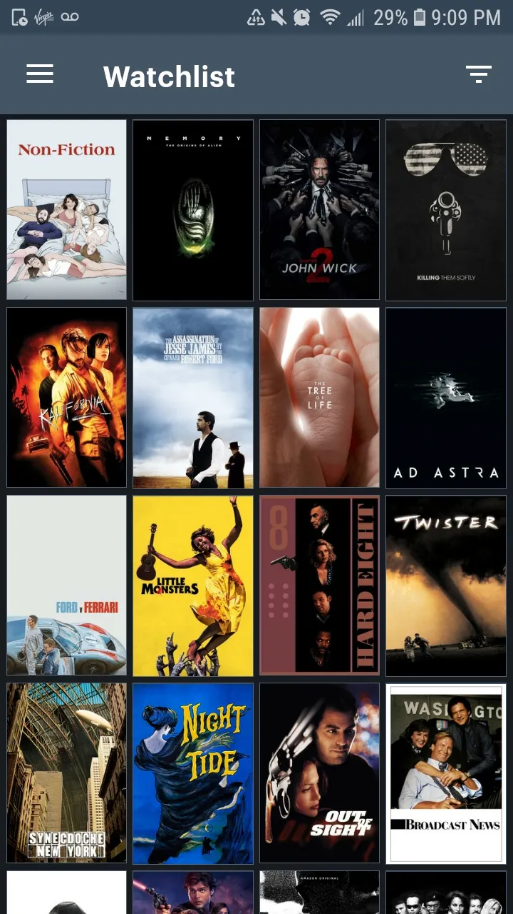
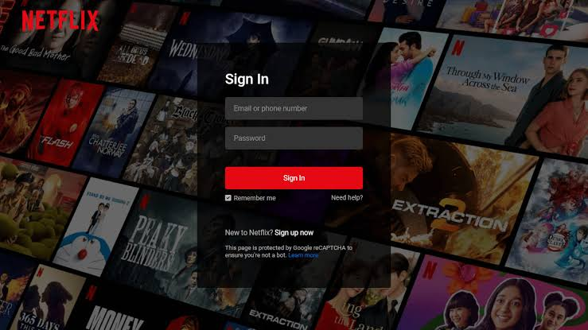

# References — MovieTv

## 1. Objetivo

As referências abaixo orientam as decisões de experiência e interface.

## 2. Referência 01 — RIOT GAMES

### Fonte
[\[URL ou identificação\]](https://mobbin.com/discover/apps/ios/latest)[Riot Games — Riot Mobile]

### Imagem 

### O que observamos?
[Observamos uma interface organizada em formato de feed, com conteúdos
apresentados em cards grandes e bastante visuais. Também há filtros por
categorias na parte superior e uma barra de navegação na parte inferior.]

### O que vamos aproveitar?
[às imagens e a navegação simples entre diferentes áreas da aplicação.]

### Como será adaptado?
[No MovieTV, os conteúdos serão filmes em vez de notícias e conteúdos sobre
jogos. Os cards apresentarão imagens dos filmes e permitirão que o usuário
adicione títulos à sua lista pessoal.

A navegação também será adaptada para funções do MovieTV, como catálogo,
pesquisa e lista de filmes.]

## 3. Referência 02 — LETTERBOXD

### Fonte
[URL ou identificação](https://logannobleauthor.medium.com/why-letterboxd-is-basically-my-new-favorite-app-5fcdd441bd5f)

### Imagem

### O que observamos?
[Observamos uma interface voltada para filmes, com grande destaque para
as capas dos títulos e recursos que permitem ao usuário criar e organizar
listas pessoais.]

### O que vamos aproveitar?
[Vamos aproveitar a ideia de permitir que o usuário selecione filmes e
adicione esses títulos a uma lista pessoal.]

### Como será adaptado?
[No MovieTV, o usuário poderá visualizar os filmes disponíveis e utilizar
um botão de adição para salvar os títulos que deseja assistir na seção
"Sua Lista".]

## 4. Referência 03 — NETFLIX

### Fonte
[\[URL ou identificação\]](https://www.codingnepalweb.com/create-netflix-login-page-html-css/)

### Imagem

### O que observamos?
[Observamos uma tela de login simples e objetiva, com poucos elementos visuais,
campos de usuário e senha e destaque para a ação principal.
]

### O que vamos aproveitar?
[Vamos aproveitar a simplicidade da interface e a organização dos elementos
para tornar o processo de entrada rápido e intuitivo.]

### Como será adaptado?
[No MovieTV, utilizaremos uma tela de login minimalista com a identidade visual
do projeto, mantendo o logo em destaque, campos de acesso e um botão principal.]